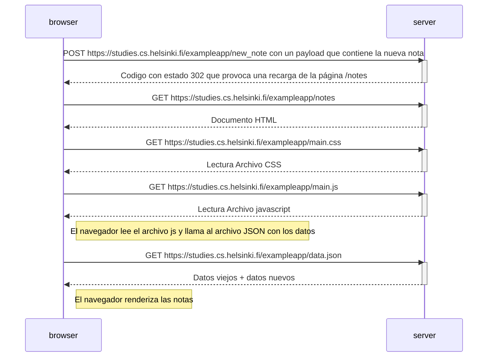

```mermaid
sequenceDiagram
    participant browser
    participant server

    browser->>server: POST https://studies.cs.helsinki.fi/exampleapp/new_note con un payload que contiene la nueva nota
    activate server
    server-->>browser: Codigo con estado 302 que provoca una recarga de la página /notes
    deactivate server

    browser->>server: GET https://studies.cs.helsinki.fi/exampleapp/notes
    activate server
    server-->>browser: Documento HTML
    deactivate server

    browser->>server: GET https://studies.cs.helsinki.fi/exampleapp/main.css
    activate server
    server-->>browser: Lectura Archivo CSS
    deactivate server

    browser->>server: GET https://studies.cs.helsinki.fi/exampleapp/main.js
    activate server
    server-->>browser: Lectura Archivo javascript
    deactivate server

    Note right of browser: El navegador lee el archivo js y llama al archivo JSON con los datos

    browser->>server: GET https://studies.cs.helsinki.fi/exampleapp/data.json
    activate server
    server-->>browser: Datos viejos + datos nuevos
    deactivate server

    Note right of browser: El navegador renderiza las notas
```